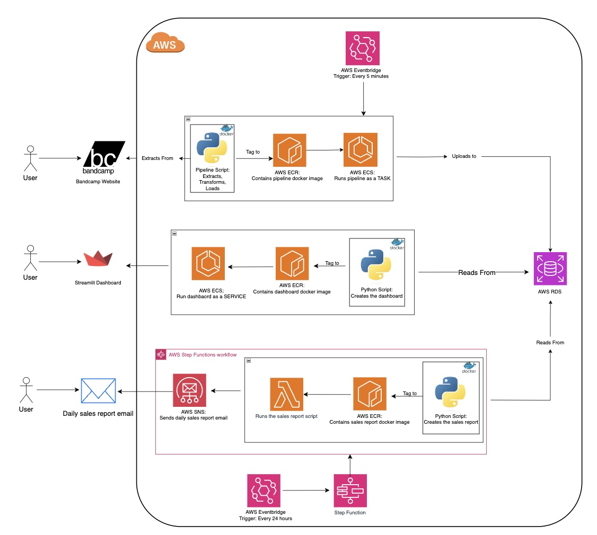
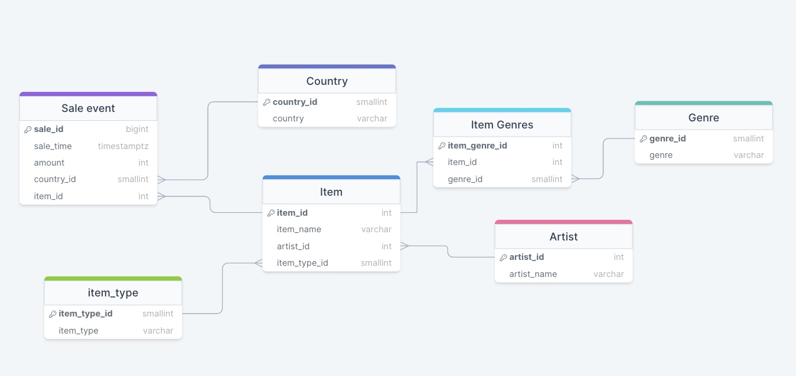

# Bandcamp-Tracker Project

The music industry is a dynamic landscape, often challenging to navigate due to its complexity. Recognising trending genres and artists before they hit mainstream popularity is crucial for music enthusiasts, industry professionals, and data analysts. This project aims to address this challenge by providing a service that tracks music purchases over time, offering valuable insights into genre trends and emerging artists.

This project is a data-driven solution that regularly scrapes the latest sales from BandCamp and combines it with genre and artist information. This data is then stored in a cloud-based database. The collected data serves as a foundation for dashboards and reports, offering a comprehensive view of the music industry's trends over time.

## Functionality

This projects implements an ETL pipeline that includes, scraping, data transformation and storage in a cloud-based environment. Python libraries such as BeautifulSoup and Pandas are used to extract and process data. Furthermore, AWS services, including Lambda and ECS facilitate the cloud-based infrastructure, ensuring scalability and reliability.

## Outputs

- Dashboard: Visual representation of sales trends and genre popularity over time.
- Daily Reports: Regularly generated PDF reports summarizing the previous day's sales.

## Requirements

## Architecture Diagram

## Entity Relationship Diagram

