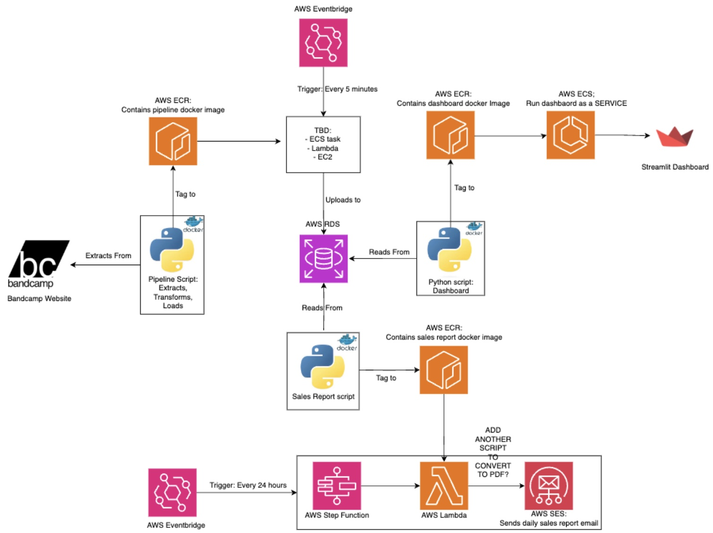
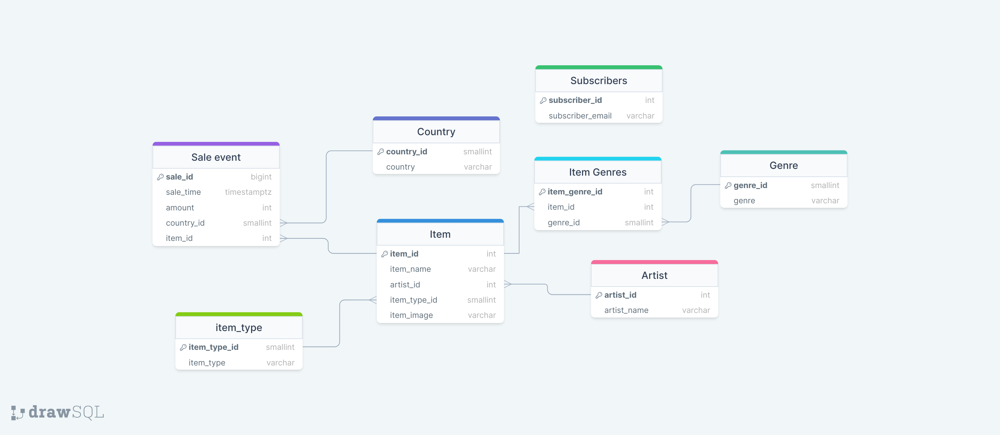

# Bandcamp-Tracker Project

The music industry is a dynamic landscape, often challenging to navigate due to its complexity. Recognising trending genres and artists before they hit mainstream popularity is crucial for music enthusiasts, industry professionals, and data analysts. This project aims to address this challenge by providing a service that tracks music purchases over time, offering valuable insights into genre trends and emerging artists.

This project is a data-driven solution that regularly scrapes the latest sales from BandCamp and combines it with genre and artist information. This data is then stored in a cloud-based database. The collected data serves as a foundation for dashboards and reports, offering a comprehensive view of the music industry's trends over time.

## Functionality

This projects implements an ETL pipeline that includes, scraping, data transformation and storage in a cloud-based environment. Python libraries such as BeautifulSoup and Pandas are used to extract and process data. Furthermore, AWS services, including Lambda and ECS, facilitate the cloud-based infrastructure, ensuring scalability and reliability.

## Folders explained
This project is divided into multiple stages where each stage is roughly divided and placed into a folder. These folders are separated as explained below:

- `pipeline` - This folder contains the code for the pipeline - the process that extracts the data, transforms it and loads it into a database.
- `report` - This folder contains the code needed to construct a report detailing.
- `dashboard` - This contains the code needed to create a Streamlit dashboard that analyses the data from the dashboard.
- `terraform` - This contains the code needed to construct our cloud infrastructure and host our service on the cloud using Terraform.

Further explanation of each stage can be found within their respective folder where a README file should explain more details.

## Ouputs
- Pipeline: Scripts to extract information from Bandcamp (through their API and via webscraping), transform it and load it into a database.
- Dashboard: Visual representation of sales trends and genre popularity over time.
- Daily Reports: Regularly generated PDF reports summarizing the previous day's sales.

## Requirements
Requirements for the project can be found within each subfolder. It is recommended that for each subfolder that you create a **virtual environment** before installing the requirements.

## Architecture Diagram
An overall view of the cloud infrastructure of the project is shown below:

## Entity Relationship Diagram
Within the RDS, the data is stored using the following schema:

